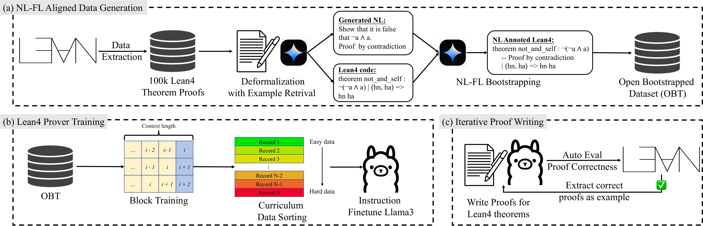
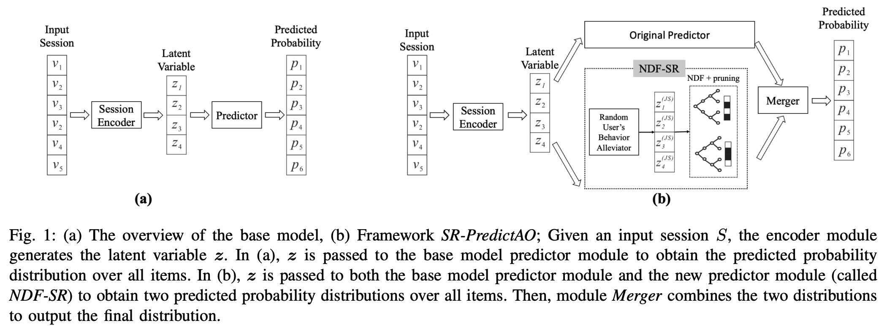

Hi! I am a first-year Ph.D. student in Computer Science at the University of Wisconsin-Madison under the supervision of [Junjie Hu](https://junjiehu.github.io/). I obtained a BSc degree in Data Science and Technology (DSCT) with a double major in Computer Science from the School of Science at the Hong Kong University of Science and Technology (HKUST). 

During my undergraduate years, I worked with Prof. [Raymond Chi-Wing WONG](https://www.cse.ust.hk/~raywong/) in Data Mining; Prof. [Mrinmaya Sachan](https://www.mrinmaya.io/) in Natural Language Processing (NLP); Prof. [Chi-Keung TANG](https://cse.hkust.edu.hk/~cktang/bio.html) and Prof. [Yu-Wing TAI](https://yuwingtai.github.io/) in Computer Vision; Prof. [Tong Zhang](https://tongzhang-ml.org/) in NLP.

My ultimate research goal is to make machine learning systems have compatible abilities with humans (of course, everybody wants that); in specific, my research pathway can be formulated as the [X2Y system](https://x.com/RickyRDWang/status/1736426770734502090); currently, I am focusing on how to use formal language like Lean to formulate underlying logic of natural language generation.

Education
===
* Ph.D. Student in Computer Science, University of Wisconsin-Madison 2024-now
* BSc in Data Science and Technology, double major in Computer Science, Hong Kong University of Science and Technology (HKUST), 2020-2024
* Exchange student at ETH Zurich

Publication
===

## \[ECCV 2024\] DragVideo: Interactive Drag-style Video Editing

[Yufan Deng](https://yfde.cc/)\*, **Ruida Wang** \*, [Yuhao Zhang](https://yzhanglp.com/)\*, [Yu-Wing Tai](https://yuwingtai.github.io/), [Chi-Keung Tang](http://www.cs.ust.hk/~cktang/) (\* indicates equal contributions)

<!--  -->

[\[Paper\]](https://arxiv.org/abs/2312.02216) [\[Github\]](https://github.com/RickySkywalker/DragVideo-Official)

---

## \[EMNLP 2023 (Findings)\] Let's Synthesize Step by Step: Iterative Dataset Synthesis with Large Language Models by Extrapolating Errors from Small Models

**Ruida Wang**, [Wangchunshu Zhou](https://michaelzhouwang.github.io/), [Mrinmaya Sachan](https://www.mrinmaya.io/)

[\[Paper\]](https://aclanthology.org/2023.findings-emnlp.791/) [\[Github\]](https://github.com/RickySkywalker/Synthesis_Step-by-Step_Official)

Preprint
===

## TheoremLlama: Transforming General-Purpose LLMs into Lean4 Experts

**Ruida Wang**\*, [Jipeng Zhang](https://2003pro.github.io/)\*, [Yizhen Jia](https://github.com/wheresmyhair)\*, [Rui Pan](https://github.com/research4pan), [Shizhe Diao](https://shizhediao.github.io/), [Renjie Pi](https://pipilurj.github.io/), [Tong Zhang](https://tongzhang-ml.org/) (\* indicates first authors)

[\[Paper\]](https://arxiv.org/abs/2407.03203/ ) [\[Github\]](https://github.com/RickySkywalker/TheoremLlama) [\[Model Ckpt\]](https://huggingface.co/RickyDeSkywalker/TheoremLlama) [\[OBT Dataset\]](https://huggingface.co/datasets/RickyDeSkywalker/OpenBootstrappedTheorem) 

## SR-PredictAO: Session-based Recommendation with High-Capability Predictor Add-On

**Ruida Wang**, [Raymong Chi-Wing Wong](https://www.cse.ust.hk/~raywong/), [Weile Tan](https://scholar.google.com/citations?user=lj7cW2oAAAAJ&hl=zh-CN)

[\[Paper\]](https://arxiv.org/abs/2309.12218) [\[Github\]](https://github.com/rickyskywalker/sr-predictao-official)

