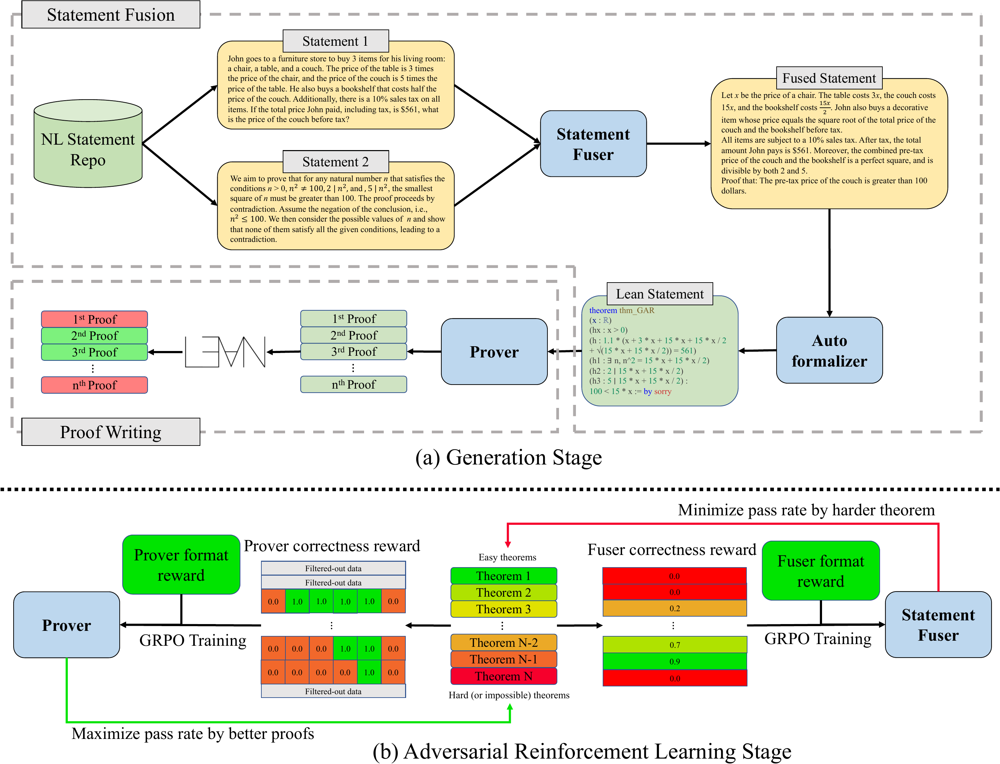
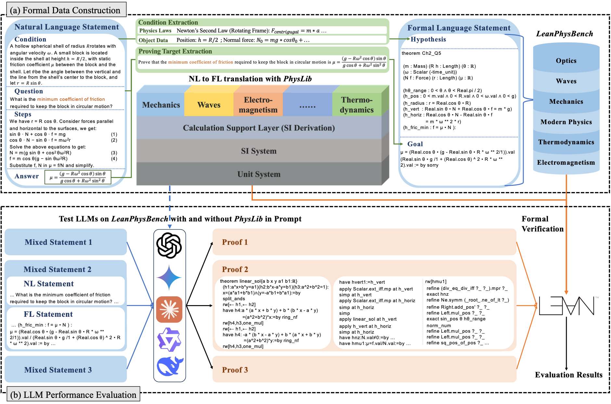
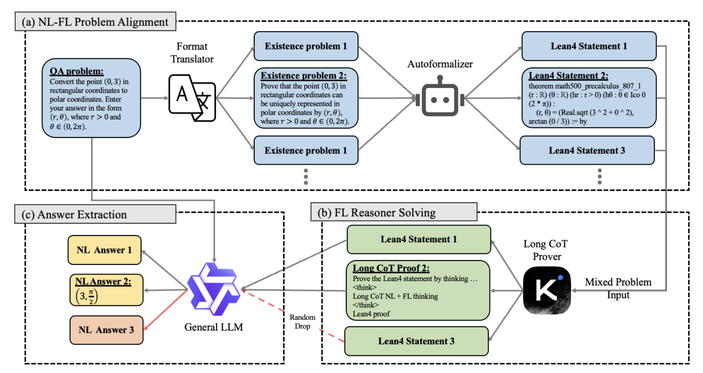
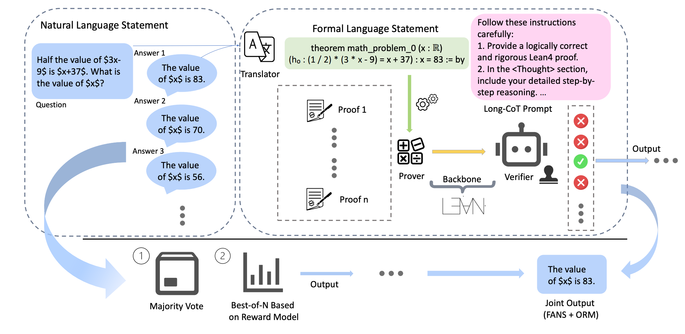
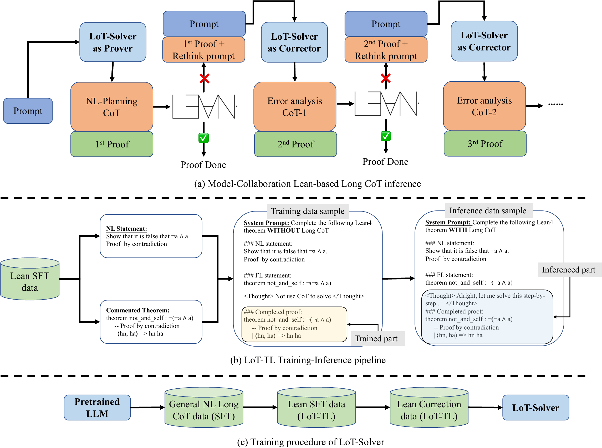
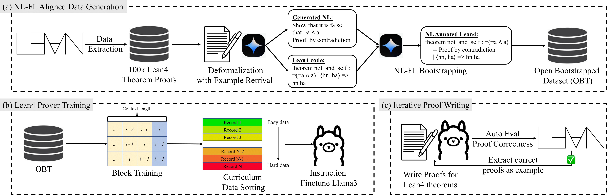
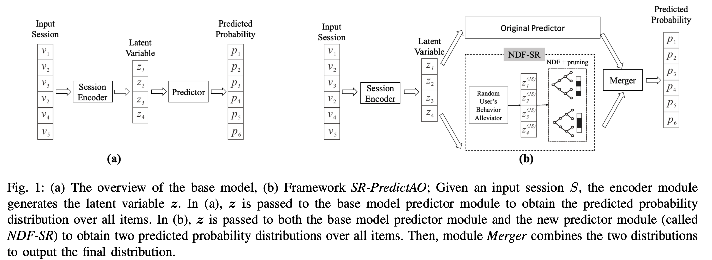
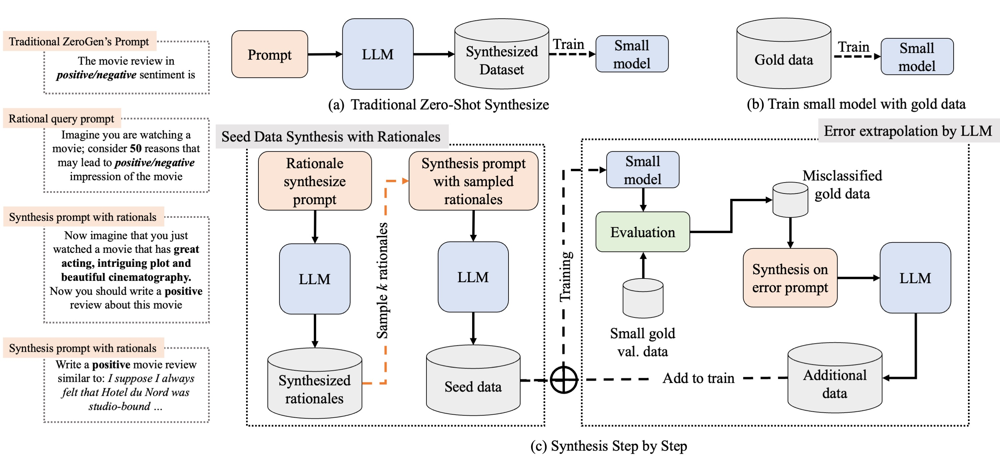
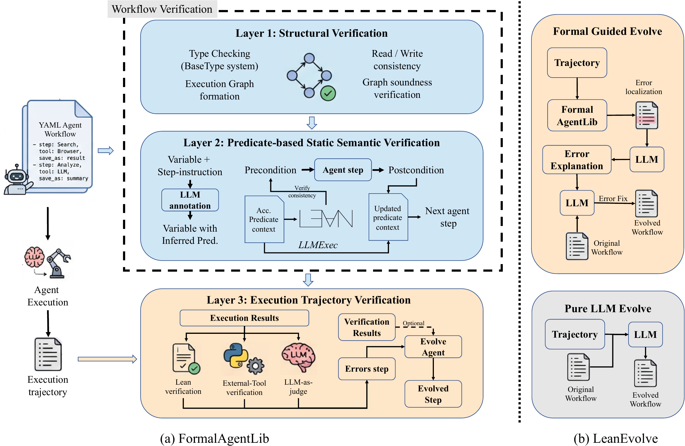

Hello there, I am a third-year Ph.D. student in Computer Science at the University of Illinois Urbana-Champaign under supervision of Professor [Tong Zhang](https://tongzhang-ml.org/). I obtained a BSc degree in Data Science and Technology (DSCT) with a double major in Computer Science from the School of Science at the Hong Kong University of Science and Technology (HKUST). 

During my undergraduate years, I worked with Prof. [Raymond Chi-Wing WONG](https://www.cse.ust.hk/~raywong/) in Data Mining; Prof. [Mrinmaya Sachan](https://www.mrinmaya.io/) in Natural Language Processing (NLP); Prof. [Chi-Keung TANG](https://cse.hkust.edu.hk/~cktang/bio.html) and Prof. [Yu-Wing TAI](https://yuwingtai.github.io/) in Computer Vision; Prof. [Tong Zhang](https://tongzhang-ml.org/) in Lean4 (formal mathematics).

My ultimate research goal is to make machine learning systems have compatible abilities with humans (of course, everybody wants that); in specific, my research pathway can be formulated as the [X2Y system](https://x.com/RickyRDWang/status/1736426770734502090); currently, I am focusing on how to use formal language like Lean to formulate underlying logic of natural language generation.

# Education

* Ph.D in Computer Science, University of Illinois Urbana-Champaign, 2025-now
* Ph.D. Student in Computer Science, University of Wisconsin-Madison, 2024-2025 (transferred to UIUC)
* BSc in Data Science and Technology, double major in Computer Science, Hong Kong University of Science and Technology (HKUST), 2020-2024
* Exchange student at ETH Zurich

# Publication

### \[ICLR 2026\] GAR: Generative Adversarial Reinforcement Learning for Formal Theorem Proving

**Ruida Wang**, [Jiarui Yao](https://maxwelljryao.github.io/), [Rui Pan](https://github.com/research4pan), [Shizhe Diao](https://shizhediao.github.io/), [Tong Zhang](https://tongzhang-ml.org/)

[\[Paper\]](https://arxiv.org/abs/2510.11769v2) [\[GitHub\]](https://github.com/RickySkywalker/GAR-Official)

### \[ICLR 2026\] Lean4Physics: Comprehensive Reasoning Framework for College-level Physics in Lean4

[Yuxin Li](https://yuxin.li/)\*, **Ruida Wang**\*, [Minghao Liu](https://mark-minghao-liu-web.github.io/)\*, [Wenzhao Ji](https://openreview.net/profile?id=~JI_WenZhao1), [Zhitao He](https://scholar.google.com/citations?user=ULvoYXgAAAAJ&hl=zh-CN), [Rui Pan](https://github.com/research4pan), [Junming Huang](https://www.junminghuang.com/), [Tong Zhang](https://tongzhang-ml.org/), [Yi R. (May) Fung](https://mayrfung.github.io/) (\* indicates first authors)

[\[Paper\]](https://arxiv.org/abs/2510.26094) [\[GitHub\]](https://github.com/ShirleyLIYuxin/Lean4PHYS)

### \[EMNLP 2025 (Main)\] Let's Reason Formally: Natural-Formal Hybrid Reasoning Enhances LLM's Math Capability

**Ruida Wang**\*, [Yuxin Li](https://yuxin.li/)\*, [Yi R. (May) Fung](https://mayrfung.github.io/), [Tong Zhang](https://tongzhang-ml.org/) (\* indicates first authors)

[\[Paper\]](https://arxiv.org/abs/2505.23703) [\[GitHub\]](https://github.com/RickySkywalker/HybridReasoning)

### \[EMNLP 2025 (Main)\] FANS: Formal Answer Selection for LLM Natural Language Math Reasoning Using Lean4

[Jiarui Yao](https://maxwelljryao.github.io/)\*, **Ruida Wang**\*, [Tong Zhang](https://tongzhang-ml.org/) (\* indicates first authors)

[\[Paper\]](https://arxiv.org/abs/2503.03238) [\[GitHub\]](https://github.com/MaxwellJryao/FANS)

### \[ICML 2025\] MA-LoT: Model-Collaboration Lean-based Long Chain-of-Thought Reasoning enhances Formal Theorem Proving

**Ruida Wang**\*, [Rui Pan](https://github.com/research4pan)\*, [Yuxin Li](https://yuxin.li/)\*, [Jipeng Zhang](https://2003pro.github.io/), [Yizhen Jia](https://github.com/wheresmyhair), [Shizhe Diao](https://shizhediao.github.io/), [Renjie Pi](https://pipilurj.github.io/), [Junjie Hu](https://junjiehu.github.io/), [Tong Zhang](https://tongzhang-ml.org/) (\* indicates first authors)

[\[Website\]](https://ma-lot.github.io/) [\[Paper\]](https://arxiv.org/pdf/2503.03205) [\[Github\]](https://github.com/RickySkywalker/LeanOfThought-Official) [\[Model Ckpt\]](https://huggingface.co/RickyDeSkywalker/LoT-Solver) 

### \[EMNLP 2024 (Main)\] TheoremLlama: Transforming General-Purpose LLMs into Lean4 Experts

**Ruida Wang**\*, [Jipeng Zhang](https://2003pro.github.io/)\*, [Yizhen Jia](https://github.com/wheresmyhair)\*, [Rui Pan](https://github.com/research4pan), [Shizhe Diao](https://shizhediao.github.io/), [Renjie Pi](https://pipilurj.github.io/), [Tong Zhang](https://tongzhang-ml.org/) (\* indicates first authors)

[\[Paper\]](https://arxiv.org/abs/2407.03203/ ) [\[Github\]](https://github.com/RickySkywalker/TheoremLlama) [\[Model Ckpt\]](https://huggingface.co/RickyDeSkywalker/TheoremLlama) [\[OBT Dataset\]](https://huggingface.co/datasets/RickyDeSkywalker/OpenBootstrappedTheorem) 

### \[ICDM 2024\] SR-PredictAO: Session-based Recommendation with High-Capability Predictor Add-On

**Ruida Wang**, [Raymong Chi-Wing Wong](https://www.cse.ust.hk/~raywong/), [Weile Tan](https://scholar.google.com/citations?user=lj7cW2oAAAAJ&hl=zh-CN)

[\[Paper\]](https://arxiv.org/abs/2309.12218) [\[Github\]](https://github.com/rickyskywalker/sr-predictao-official)

---

### \[ECCV 2024\] DragVideo: Interactive Drag-style Video Editing

[Yufan Deng](https://yfde.cc/)\*, **Ruida Wang** \*, [Yuhao Zhang](https://yzhanglp.com/)\*, [Yu-Wing Tai](https://yuwingtai.github.io/), [Chi-Keung Tang](http://www.cs.ust.hk/~cktang/) (\* indicates equal contributions)

<!--  -->

[\[Paper\]](https://arxiv.org/abs/2312.02216) [\[Github\]](https://github.com/RickySkywalker/DragVideo-Official)

---

### \[EMNLP 2023 (Findings)\] Let's Synthesize Step by Step: Iterative Dataset Synthesis with Large Language Models by Extrapolating Errors from Small Models

**Ruida Wang**, [Wangchunshu Zhou](https://michaelzhouwang.github.io/), [Mrinmaya Sachan](https://www.mrinmaya.io/)

[\[Paper\]](https://aclanthology.org/2023.findings-emnlp.791/) [\[Github\]](https://github.com/RickySkywalker/Synthesis_Step-by-Step_Official)

Preprint
===

### Lean4Agent: Formal Modeling and Verification for Agent Workflow and Trajectory

**Ruida Wang**, [Jerry Huang](https://jh603.github.io/), [Pengcheng Wang](https://pchengwang.github.io/), [Xuanqing Liu](https://xuanqing94.github.io/), [Luyang Kong](https://www.linkedin.com/in/luyangkong/), [Tong Zhang](https://tongzhang-ml.org/)

[\[Paper\]](https://github.com/RickySkywalker/Lean4Agent/blob/main/assets/paper.pdf) [\[GitHub\]](https://github.com/RickySkywalker/Lean4Agent)

---

